# Sard 🧸📖

Sard is a Flutter app that provides fun and educational stories for children. It features a welcome screen with logo animation, authentication (login, signup, OTP, forgot password), and a Bottom Navigation Bar for easy navigation.

---

## 📌 Project Overview 📖

Project Name: Sard

This app provides:

- 🎬 Welcome Screen: Animated logo and introduction  
- 🔐 Authentication Screens: Login, Signup, Forgot Password, OTP verification  
- 🏠 Home Screen: Shows authors and stories  
- 🔍 Search Screen: Search for specific stories  
- 💖 Favorites Screen: View your favorite stories  
- 📚 Category Screen: Browse stories by categories  
- 👤 Profile Screen: View personal information, app info, and settings  
- ⚙️ Settings: Change theme (Dark/Light) and app notifications  

---

## 📦 Packages Used

- bloc 
- fpdart
- gap
- get_it
- lottie
- sizer
- go_router
- flutter_svg
- flutter_bloc
- flutter_hooks
- any_image_view
- carousel_slider
- curved_navigation_bar
- flutter_launcher_icons
- flutter_otp_text_field

---

## 📸 Screenshots

Here are some screenshots of the Sard app:

| Welcome Screen | Login Screen | Signup Screen |
|---|---|---|
|  | 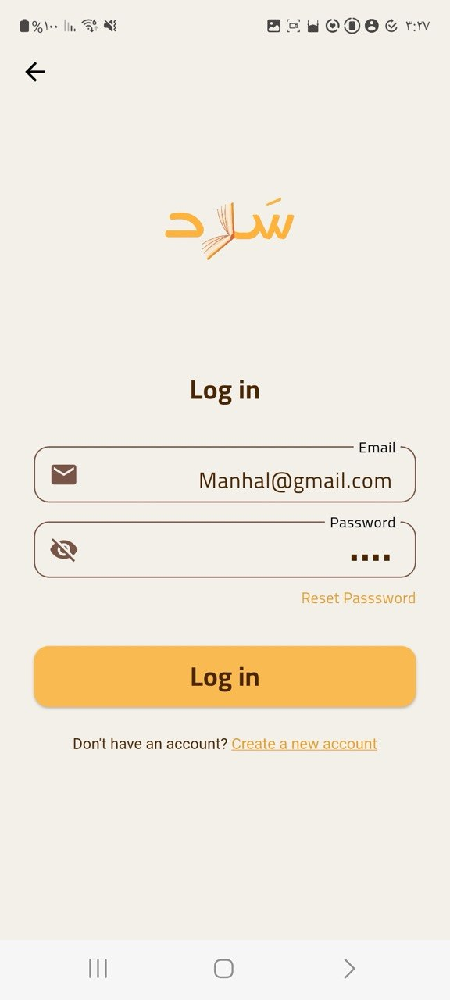 | 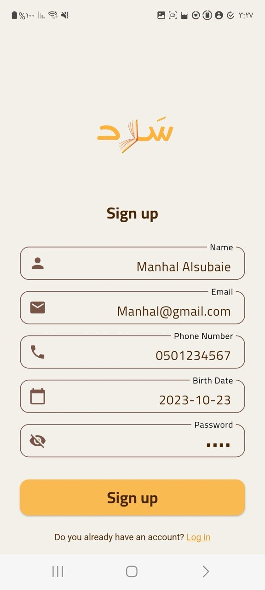 |

| Home Screen | Search Screen | Favorites Screen |
|---|---|---|
| 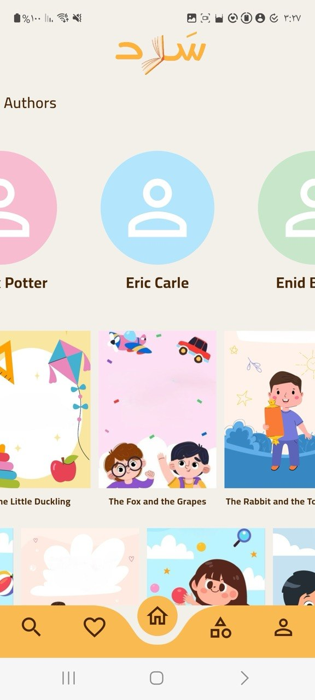 | 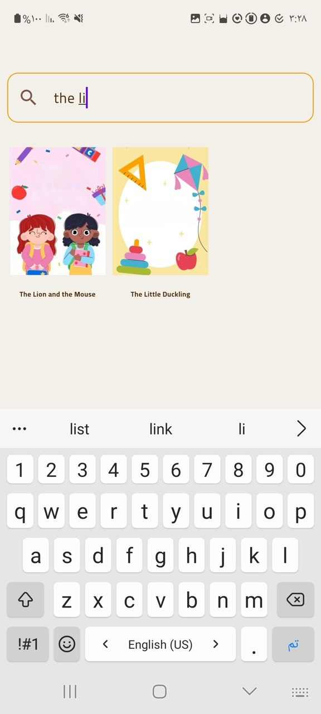 | 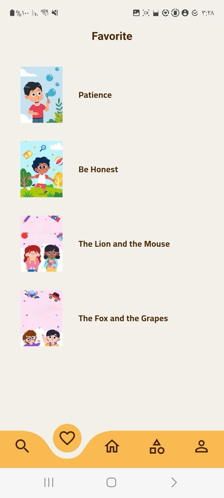 |

| Category Screen | Profile Screen | Settings Screen |
|---|---|---|
| 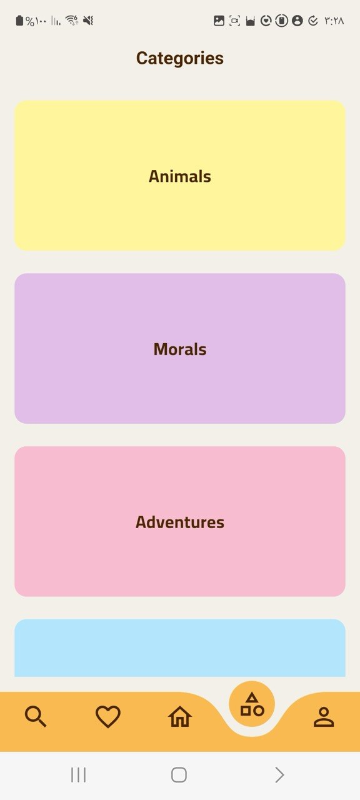 | 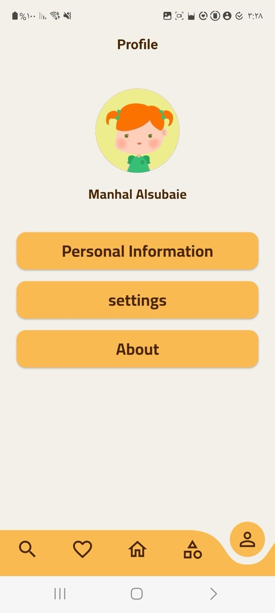 | 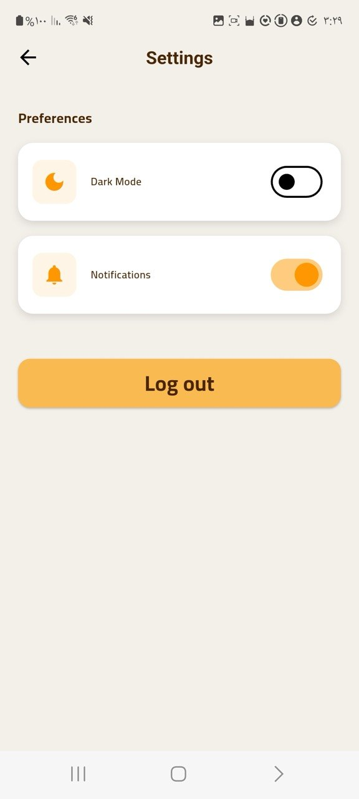 |

| Dark Mode | Story Info Screen | Author Info Screen |
|---|---|---|
| 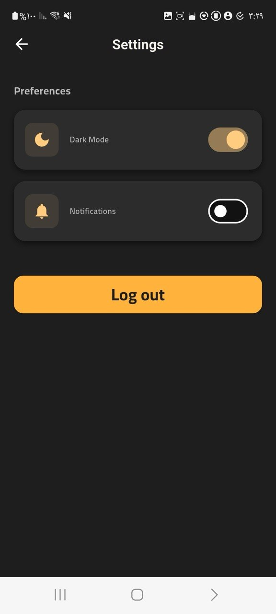 | 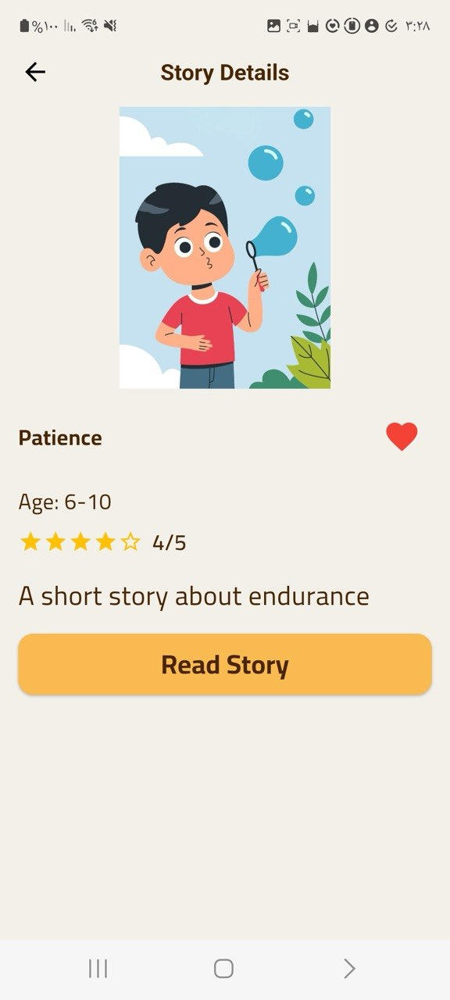 | 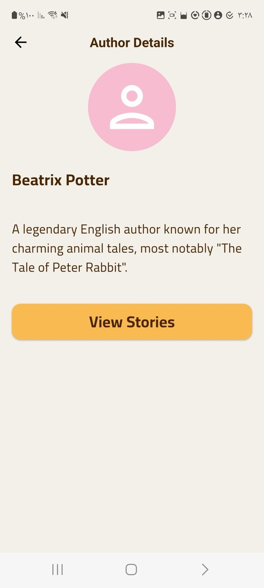 |

---

## 🎬 Demo Video

Quick overview of app functionality:  

https://github.com/user-attachments/assets/14cb52ed-ffe9-4937-8cda-2c901959fa0e

---

## ⚙️ Setup & Installation
1. Clone the repository: `git clone https://github.com/flutter-gg-2026/capstone-i-manhal203.git`
2. Install dependencies: `flutter pub get`
3. Run the app: `flutter run`
